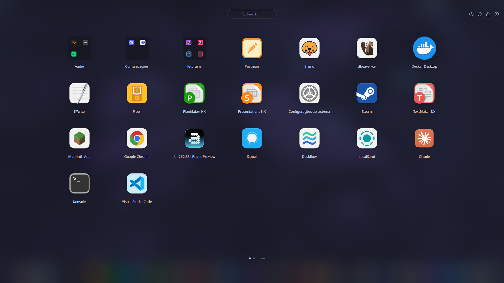

<p align="center">
  
</p>

<h1 align="center">AppBay Launchpad</h1>

<p align="center">
  Launcher em tela cheia estilo <b>Launchpad do macOS</b> para o <b>KDE Plasma 6</b>:<br>
  grade 7×5, páginas, pastas, arrastar para reorganizar e animação de zoom.
</p>

---

> [!IMPORTANT]
> **Este projeto é um fork do [AppBay](https://store.kde.org/p/2327339/), criado por **zayronxio**.**
> Todo o crédito pelo widget original é dele. Aqui estão só os ajustes feitos em cima da versão 0.2.7,
> distribuídos sob a mesma licença (GPL-3.0). Se gostou, apoie o autor original.

## Prints

<p align="center">
  
</p>
<p align="center"><sub>Grade 7×5 com pastas (Audio, Comunicações, Jetbrains), busca no topo e as bolinhas de página com o botão <b>+</b>.</sub></p>

<p align="center">
  
</p>
<p align="center"><sub>O ícone de foguete como primeiro item do dock, no estilo dos ícones Colloid.</sub></p>

## O que mudou em relação ao AppBay original

**Correções para o Plasma 6.6**
- Cores do tema quebradas: a API `PlasmaCore.Theme` foi trocada por `Kirigami.Theme`.
- Erros no log ao abrir o launcher e as pastas.
- Contagem de páginas errada, que escondia o último app quando o total passava de um múltiplo de 35 (por exemplo, 36 apps).

**Comportamento estilo macOS**
- Grade fixa de **7 colunas × 5 linhas**, com as células se ajustando à tela.
- **Clicar e arrastar para o lado** troca de página. Rolagem horizontal do touchpad também funciona.
- **Clicar e segurar** um ícone pega o app. Com ele na mão, você pode:
  - soltar no **centro** de outro app para criar uma pasta;
  - soltar **entre** dois ícones ou num espaço vazio para mudar o app de lugar;
  - levar até a **borda** da tela para ir para outra página.
- **Páginas explícitas:** crie e remova páginas com os botões **+** e **−** ao lado das bolinhas. Na última página, levar um app até a borda direita cria uma página nova.
- A ordem dos apps e as páginas ficam salvas. Apps instalados depois vão para o final.

**Extras**
- Sem a barra de favoritos por padrão, para não competir com o seu dock.
- Ícone de foguete novo, inspirado no Launchpad clássico. Uma versão em grade também vem incluída.
- Efeito do KWin (`launchpadzoom`) com a animação de zoom e fade ao abrir e fechar.
- Instalador que coloca o launcher no painel e liga a **tecla Meta** a ele.

## Requisitos

- **KDE Plasma 6.** Testado no Plasma 6.6, em Wayland.
- O módulo **Qt5Compat** do Qt 6 (veja o comando da sua distro abaixo).

> [!WARNING]
> Distros que ainda usam **Plasma 5** não são suportadas. Isso inclui Ubuntu/Kubuntu 24.04 LTS e Debian 12.

## Instalação

### 1. Instale a dependência

| Distro | Comando |
|---|---|
| **Fedora KDE** (40 ou mais novo) | `sudo dnf install qt6-qt5compat git` |
| **Kubuntu / Ubuntu** (25.04 ou mais novo), **KDE neon**, **Debian 13** | `sudo apt install qml6-module-qt5compat-graphicaleffects git` |
| **Arch**, **Manjaro**, **EndeavourOS**, **CachyOS** | `sudo pacman -S --needed qt6-5compat git` |
| **openSUSE Tumbleweed** | `sudo zypper install qt6-qt5compat-imports git` |

### 2. Baixe e instale

```bash
git clone https://github.com/nicolasdesenv/appbay-launchpad.git
cd appbay-launchpad
bash instalar.sh
```

Sem git: baixe o [ZIP](https://github.com/nicolasdesenv/appbay-launchpad/archive/refs/heads/main.zip) e extraia.
Depois, clique com o botão direito dentro da pasta, escolha **Abrir terminal aqui** e rode `bash instalar.sh`.

O instalador:
1. instala o widget, os ícones e o efeito de animação na sua pasta de usuário (não precisa de `sudo`);
2. coloca o launcher como primeiro item do painel que tem a barra de tarefas ou o dock;
3. faz a **tecla Meta** abrir o launcher (o menu padrão continua no **Alt+F1**);
4. reinicia o painel. A tela pisca por alguns segundos, e isso é normal.

<details>
<summary>Instalação manual (sem o script)</summary>

```bash
kpackagetool6 -t Plasma/Applet -i package/Plasma.AppBay
mkdir -p ~/.local/share/icons/hicolor/scalable/apps
cp icons/*.svg ~/.local/share/icons/hicolor/scalable/apps/
mkdir -p ~/.local/share/kwin/effects && cp -r kwin-effect/launchpadzoom ~/.local/share/kwin/effects/
```

Depois:
- **Widget:** clique com o botão direito no painel → **Adicionar widgets** → **AppBay Launchpad**.
- **Animação:** Configurações do Sistema → Efeitos da área de trabalho → ative **Launchpad Zoom**.

</details>

## Como usar

| Ação | Como fazer |
|---|---|
| Abrir / fechar | Tecla **Meta**, clique no foguete do painel ou **Esc** |
| Buscar um app | Comece a digitar |
| Trocar de página | Arraste para o lado, role o mouse, deslize no touchpad ou clique nas bolinhas |
| Pegar um ícone | Clique e **segure** por meio segundo |
| Criar pasta | Segure um app e solte no **centro** de outro |
| Adicionar à pasta | Segure o app e solte em cima da pasta |
| Mudar de lugar | Segure o app e solte **entre** dois ícones ou num espaço vazio |
| Levar para outra página | Segure o app e leve até a borda da tela |
| Criar página | Botão **+** ao lado das bolinhas |
| Remover página | Botão **−** (só em página vazia) |
| Renomear pasta / esconder app | Botão direito no item |

## Atualizar

Suas pastas, a ordem dos apps e as páginas são mantidas na atualização.

### 1. Atualize o sistema (recomendado)

O launcher depende do Plasma e do Qt5Compat da sua distro. Deixe os dois em dia antes de atualizar o widget:

| Distro | Comando |
|---|---|
| **Fedora KDE** | `sudo dnf upgrade --refresh` |
| **Kubuntu / Ubuntu**, **KDE neon**, **Debian 13** | `sudo apt update && sudo apt full-upgrade` (no **KDE neon**, prefira `sudo pkcon update`) |
| **Arch**, **EndeavourOS**, **CachyOS** | `sudo pacman -Syu` |
| **Manjaro** | `sudo pacman -Syu` ou `pamac upgrade` |
| **openSUSE Tumbleweed** | `sudo zypper dup` |

Se o sistema atualizou o Plasma, reinicie a sessão antes de seguir.

### 2. Baixe a versão nova e reinstale

É igual em todas as distros. Na pasta onde você clonou o projeto:

```bash
cd appbay-launchpad
git pull
bash instalar.sh
```

Instalou pelo ZIP? Baixe o [ZIP novo](https://github.com/nicolasdesenv/appbay-launchpad/archive/refs/heads/main.zip), extraia por cima da pasta antiga e rode `bash instalar.sh` de novo.

O instalador percebe que o widget já está instalado e só troca os arquivos. O painel reinicia e a tela pisca, como na primeira instalação.

Para ver a versão instalada:

```bash
kpackagetool6 -t Plasma/Applet -s Plasma.AppBay
```

> [!NOTE]
> Até a versão `0.2.7-launchpad.1`, as pastas sumiam quando o Plasma reiniciava ou quando você saía da sessão.
> Pastas que já sumiram não voltam com a atualização. Crie de novo uma vez, e a partir daí elas ficam salvas.

## Desinstalar

```bash
bash desinstalar.sh
```

O script remove o widget, os ícones e a animação, e devolve a tecla Meta ao menu padrão.

## Limitações conhecidas

- Não atualize este widget pela loja do KDE (**Obter novos widgets**). A loja instala o AppBay original por cima e desfaz os ajustes. Para atualizar, veja [Atualizar](#atualizar).
- Só dá para remover páginas vazias. Tire os apps da página antes.

## Créditos e licença

- **Widget original:** [AppBay](https://store.kde.org/p/2327339/), de **zayronxio**, GPL-3.0.
- **Ajustes deste fork, ícones e efeito `launchpadzoom`:** [nicolasdesenv](https://github.com/nicolasdesenv).

Distribuído sob a **GNU General Public License v3.0**. O texto completo está em [LICENSE](LICENSE).
